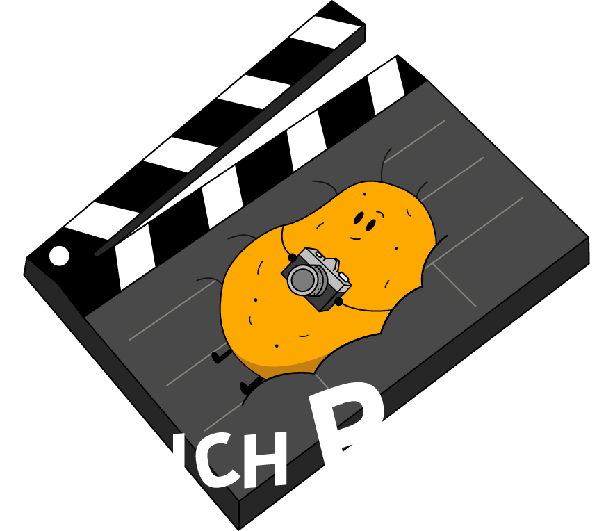

# 🎬 COUCH POTATO

<div align="center">
  
  
  ### 브랜드의 이야기를 영상으로 완성하는 크리에이티브 스튜디오
  
  [](https://nextjs.org/)
  [](https://www.typescriptlang.org/)
  [](https://tailwindcss.com/)
  [](https://vercel.com/)
</div>

---

## 🌟 프로젝트 소개

**COUCH POTATO**는 창의적인 영상 제작을 통해 브랜드의 가치를 전달하는 전문 영상 제작 스튜디오의 공식 웹사이트입니다.

현대적이고 세련된 디자인과 완벽한 반응형 레이아웃을 통해 고객에게 최고의 사용자 경험을 제공합니다.

### ✨ 핵심 가치

- **창의성**: 독창적인 아이디어와 혁신적인 접근
- **신뢰**: 고객과의 약속을 지키는 투명한 소통
- **전문성**: 최신 기술과 트렌드를 바탕으로 한 전문 퀄리티

---

## 🚀 주요 기능

### 📱 **완벽한 반응형 디자인**

- 모바일, 태블릿, 데스크톱 모든 디바이스 최적화
- 터치 친화적인 인터페이스
- 일관된 사용자 경험 제공

### 🎥 **인터랙티브 비디오 플레이어**

- YouTube API 통합
- 커스텀 비디오 컨트롤
- 전체화면 모드 지원
- 볼륨 조절 기능

### 🎨 **모던 UI/UX**

- 글라스모피즘 디자인
- 부드러운 애니메이션 효과
- 그라데이션과 그림자 활용
- 직관적인 네비게이션

### 📧 **스마트 연락 시스템**

- 이메일 자동 연동
- 실시간 폼 검증
- 다양한 연락 방법 제공
- 모바일 최적화된 연락 폼

---

## 🛠 기술 스택

### **Frontend**

- **Framework**: Next.js 14 (App Router)
- **Language**: TypeScript
- **Styling**: Tailwind CSS + Custom CSS
- **UI Components**: Custom React Components
- **Icons**: React Icons
- **Animations**: CSS Animations + Tailwind Transitions

### **Integrations**

- **Video**: YouTube Player API
- **Email**: EmailJS
- **Images**: Next.js Image Optimization
- **Fonts**: Google Fonts (System Fonts)

### **Development Tools**

- **Package Manager**: npm
- **Code Quality**: ESLint + Prettier
- **Version Control**: Git
- **Deployment**: Vercel

---

## 📁 프로젝트 구조

```
couch-potato/
├── 📂 public/
│   ├── 📂 imgs/           # 이미지 assets
│   │   ├── mainlogo.png   # 메인 로고
│   │   ├── 1.jpg, 2.jpg   # 포트폴리오 이미지
│   │   └── ...
│   └── 📄 *.svg           # 아이콘 파일들
├── 📂 src/
│   ├── 📂 app/
│   │   ├── 📂 components/
│   │   │   └── 📂 layouts/
│   │   │       ├── Navbar.tsx    # 네비게이션 바
│   │   │       ├── Sidebar.tsx   # 모바일 사이드바
│   │   │       └── Footer.tsx    # 푸터
│   │   ├── 📂 about/      # 회사 소개 페이지
│   │   ├── 📂 portfolio/  # 포트폴리오 페이지
│   │   ├── 📂 process/    # 제작 과정 페이지
│   │   ├── 📂 location/   # 촬영 위치 페이지
│   │   ├── 📂 contact/    # 연락처 페이지
│   │   ├── 📄 globals.css # 글로벌 스타일
│   │   ├── 📄 layout.tsx  # 루트 레이아웃
│   │   └── 📄 page.tsx    # 홈 페이지
│   └── 📂 utils/
│       └── youtube.ts     # YouTube API 유틸
├── 📄 tailwind.config.ts  # Tailwind 설정
├── 📄 next.config.mjs     # Next.js 설정
├── 📄 tsconfig.json       # TypeScript 설정
└── 📄 package.json        # 프로젝트 의존성
```

---

## 🎯 페이지 구성

| 페이지         | 경로         | 설명                                  |
| -------------- | ------------ | ------------------------------------- |
| **홈**         | `/`          | 메인 페이지, 히어로 섹션, 서비스 소개 |
| **회사소개**   | `/about`     | 회사 스토리, CEO 메시지, 핵심 가치    |
| **포트폴리오** | `/portfolio` | 작품 갤러리, 카테고리별 필터링        |
| **제작과정**   | `/process`   | 5단계 제작 프로세스, 타임라인         |
| **촬영위치**   | `/location`  | 촬영 장소, 서비스 지역 안내           |
| **연락하기**   | `/contact`   | 견적 문의 폼, 연락처 정보             |

---

## 🚀 설치 및 실행

### **필수 요구사항**

- Node.js 18.0 이상
- npm, yarn, pnpm 또는 bun

### **설치**

```bash
# 저장소 클론
git clone https://github.com/your-username/couch-potato.git
cd couch-potato

# 의존성 설치
npm install
# 또는
yarn install
```

### **개발 서버 실행**

```bash
npm run dev
# 또는
yarn dev
# 또는
pnpm dev
# 또는
bun dev
```

브라우저에서 [http://localhost:3000](http://localhost:3000)을 열어 결과를 확인하세요.

### **빌드**

```bash
# 프로덕션 빌드
npm run build

# 빌드 결과 실행
npm start
```

---

## 🎨 디자인 시스템

### **컬러 팔레트**

```css
/* Primary Colors */
--yellow-400: #facc15    /* 메인 액센트 */
--orange-500: #f97316    /* 그라데이션 */
--blue-500: #3b82f6      /* 링크 및 버튼 */
--purple-600: #9333ea    /* 그라데이션 */

/* Grayscale */
--gray-50: #f9fafb       /* 배경 */
--gray-900: #111827      /* 텍스트 */
--black: #000000         /* 다크 배경 */
--white: #ffffff         /* 라이트 배경 */
```

### **타이포그래피**

- **제목**: 3xl ~ 9xl (반응형)
- **본문**: base ~ xl (반응형)
- **폰트**: System UI, -apple-system, BlinkMacSystemFont

### **반응형 브레이크포인트**

```css
sm: 640px   /* 작은 태블릿 */
md: 768px   /* 태블릿 */
lg: 1024px  /* 데스크톱 */
xl: 1280px  /* 큰 데스크톱 */
2xl: 1536px /* 초대형 화면 */
```

---

## 🔧 주요 기능 상세

### **YouTube 비디오 통합**

```typescript
// YouTube Player API 활용
const player = new window.YT.Player(element, {
  videoId: "VIDEO_ID",
  playerVars: {
    autoplay: 1,
    mute: 1,
    controls: 1,
  },
});
```

### **이메일 연동**

```typescript
// 스마트 이메일 시스템
const emailUrl = `mailto:contact@example.com?subject=${subject}&body=${body}`;
window.location.href = emailUrl;
```

### **반응형 네비게이션**

- 데스크톱: 글라스모피즘 네비게이션 바
- 모바일: 햄버거 메뉴 + 슬라이드 사이드바

---

## 📱 반응형 최적화

### **모바일 우선 설계**

- Touch-friendly 버튼 크기 (44px 이상)
- 적절한 텍스트 크기 및 줄 간격
- 스크롤 최적화

### **성능 최적화**

- Next.js Image 컴포넌트 활용
- 코드 스플리팅
- 지연 로딩 (Lazy Loading)
- CSS 최적화

---

## 🌐 배포

### **Vercel 배포**

```bash
# Vercel CLI 설치
npm i -g vercel

# 배포
vercel
```

## 📞 연락처

**COUCH POTATO** - 브랜드의 이야기를 영상으로 완성하는 크리에이티브 스튜디오

<div align="center">
  
### ⭐ 이 프로젝트가 마음에 드셨다면 Star를 눌러주세요!

**Made with ❤️ by COUCH POTATO Team**

</div>
